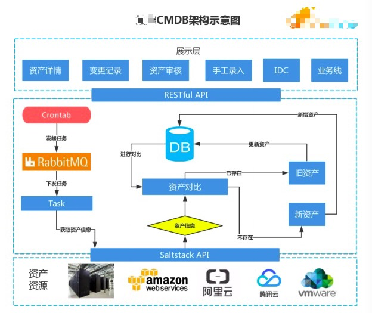
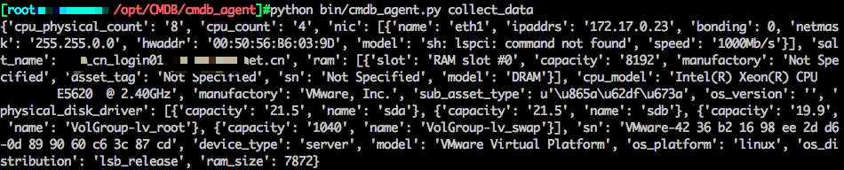
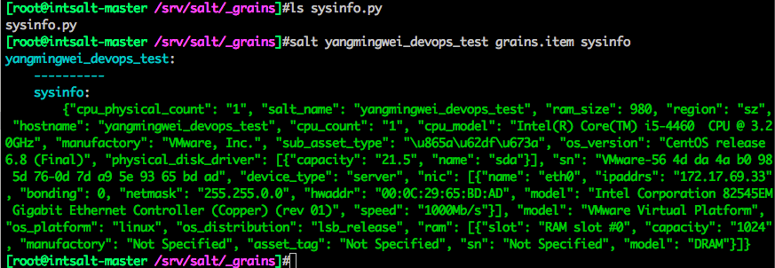
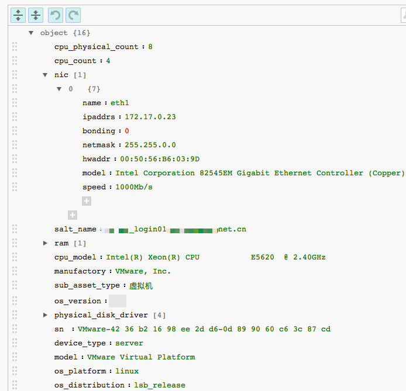
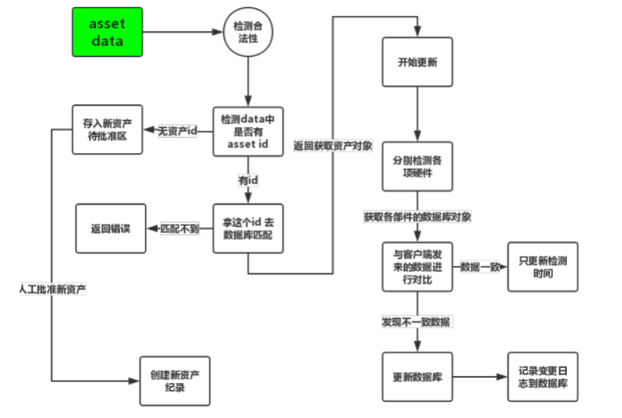
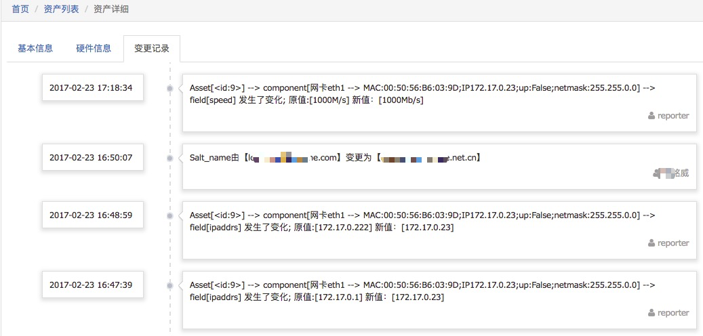
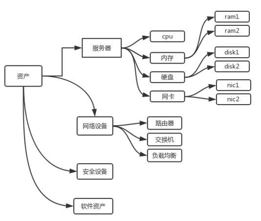
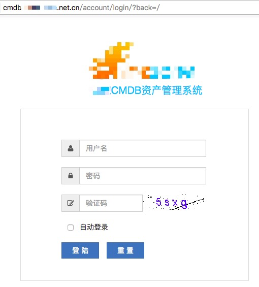
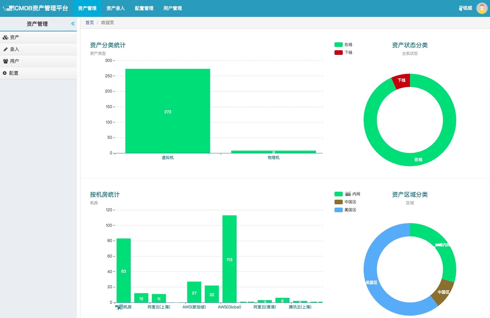
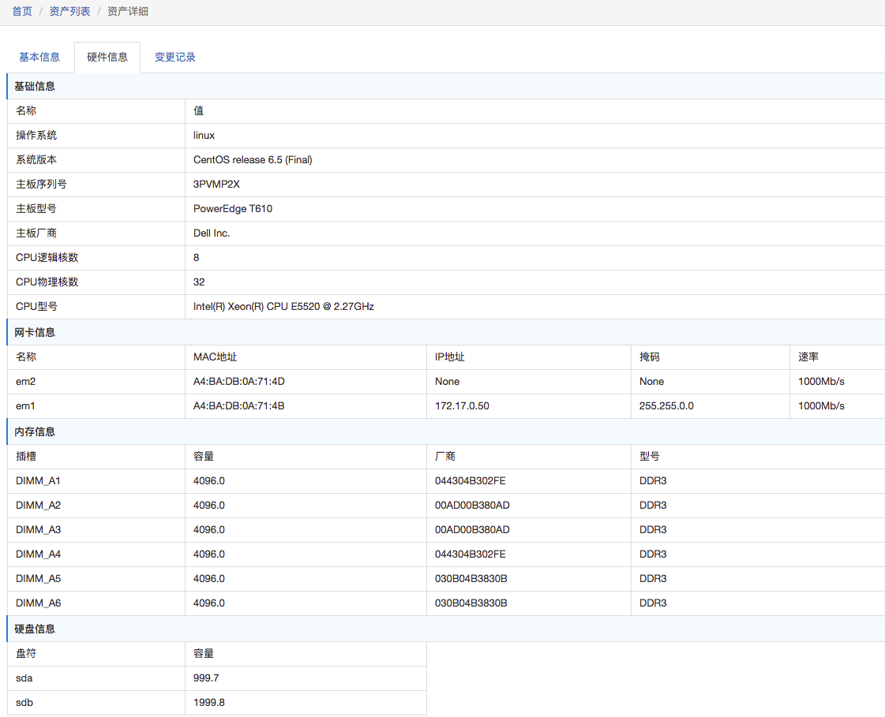

## CMDB介绍
CMDB --Configuration Management Database 配置管理数据库, CMDB存储与管理企业IT架构中设备的各种配置信息，它与所有服务支持和服务交付流程都紧密相联，支持这些流程的运转、发挥配置信息的价值，同时依赖于相关流程保证数据的准确性。在实际的项目中，CMDB常常被认为是构建其它ITIL流程的基础而优先考虑，ITIL项目的成败与是否成功建立CMDB有非常大的关系。

### 一、需求分析

- 存储所有IT资产信息

- 数据可手动添加

- 硬件信息可自动收集

- 硬件信息可自动变更

- 可对其它系统灵活开放API

- API接口安全认证

- [Web Terminal,操作审计,录像回放](https://github.com/yangmv/SuperCMDB.git)

#### 资产类型：

- 服务器(物理机/虚拟机)

- 网络设备(路由器/交换机/AP)

- 机房设备(机柜/UPS)

- 软件资产(操作系统license)

#### 资产属性:

- 品牌、型号、位置、用途、IP

- 供应商、厂商、合同、购买日期

### 二、架构设计

#### 功能模块

- 资产搜集： 通过salt搜集各minion资产信息并统一汇报至CMDB

- 资产审核： 资产首次汇报需要人工审核

- 资产查询： 可多条件复杂查询

- 对外API：  方便其他系统调用资产接口信息,如运维自动化平台

- 自动变更： 资产变更更新及变更记录

- 自动监控： (计划)

- 告警自愈： (暂无）

#### 什么是对外API：
对外API接口就是提供一个可以对外部系统访问的URL,如 http://api.***.com/
外部系统可以通过GET/POST等方法来获取想要的数据。如运维自动化平台需要展示各机房有多少台主机，这时向API传递指定的参数，API即可反馈给相应的结果。

#### 什么时候自动监控：
当cmdb有新主机上线，则自动添加zabbix监控，并根据主机类型关联相应监控模板，如web服务器则关联web监控模板；主机下线，则自动禁用zabbix监控。

#### 什么是告警自愈：
当系统发现机器的CPU有异常的时候，需要对 CPU高负载进行故障干预和恢复，这种情况下我们怎么做？我们可以取到告警的信息，告警里会告诉我这台机器的IP地址和告警的值； 通过IP，可以从CMDB中查一下这个机器属于哪个业务，再根据业务信息可以查询到同业务下还有那些机器； 然后我们通过同业务的IP地址把其它机器的当前CPU值都查询出来，得出的平均值再去和告警的CPU值来对比； 最后判断出是否需要系统干预。如果需要修复，系统会根据告警的IP地址到CMDB中去查询相应的恢复策略，再进行处理。通过这种灵活和完整的验证处理闭环，我们就可以构建出各种可靠的自动故障恢复策略。

### 三、资产收集/汇报
采集硬件信息，一般有两种模式：主动采集，和被动采集；

- 编写agent,客户端定时执行=>汇报给服务端API接口 (被动)
- salt的grains采集功能主动采集(主动)
- pupppet的report、ansible、zabbix等

之前采用的是第一种方法，写了一个客户端脚本支持linux和windows和linux，然后每天定时汇报给服务端的API接口。agent用salt或者ansible批量推过去就可以了。

后来因考虑到agent版本更新等维护成本高，索性改用第二种方法，用salt自定义了一个grains并分发至所有minion，granis来搜集minion的资产信息，然后调用salt-api定时搜集所有minion返回的granis信息即可。

方法1 如图 ：

 方法二，如图：
（后台通过salt-api来获取即可）

采集到的数据，可以用在线json解析一下查看

 ok,这样客户端数据就拿到了，发送给Server的API接口来接收就行了。

### 四、资产收集/汇报

以下是资产变更展示

### 五、表结构设计

### 六、部分展示

